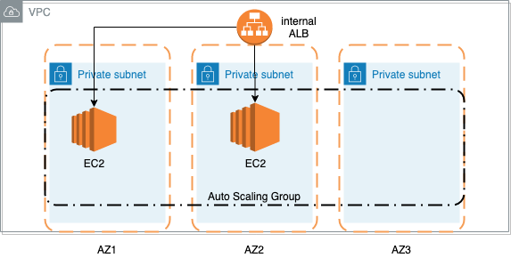

Prerequisite
===================================
1. You have AWS account with VPC and 3 subnets configured
2. and your private subnets can access internet by NATGateway
3. You have installed awscli locally, and you have configured AWS creds in **credentials** file, with **region = ap-southeast-2**
4. Clone this repo to your local

Deploy
===================================

## Parameter
You will need to update the following 4 parameters from **common.mk** file.
1. Keypair that used to ssh to EC2 instance: **```KEY_NAME```**
2. Your VPC ID: **```VPCID```**
3. Internal_Cider IP range that is allowed to ssh on 22 port, and access the webapp 80 port: **```Internal_CiderIp```**
4. VPC subnets **Name** tag that will be used to query Subnet ID within the above VPC: **```VPC_Subnet_Tag```**
    * **Please note**: if your VPC subnets does not have **Name** tag, please remove the query and directly provide SubnetsID for parameters: SubnetPrivateA, SubnetPrivateB, SubnetPrivateC, eg: ```SubnetPrivateA=subnet-exampleid1234567```

## How to deploy

1. Before deploy, run:
    ```
    make check-params
    ```
   check output parameters, and verify the vpc and 3 subnets are all correct, also make sure bucket ```${ACCOUNTID}-${STACKNAME}``` doesnot exist
2. If all parameters are correct, you can start deployment by run 
    ```
    make deploy-new
    ```
    * **please note**: if you want to update the existing stack (S3 bucket is created already, and scripts zip file has uploaded to S3), only run ```make deploy```, this will not create s3 bucket, but only upload zip file and update cloudformation stack

Wait for the stack creation complate (stack name: ${SERVICE_NAME}-${ENVIRONMENT_TYPE}-${APP_NAME}), once EC2 is ready, come to the cloudformation console --> stack output, and simply click the output url (https//${LoadBalancer.DNSName}:80)

## what resources will be created

1. s3 bucket with name ```${ACCOUNTID}-${STACKNAME}```, which will be used to store scripts as well as web servers config files
2. EC2, ASG, IAM, ALB, SG, ASG Policy

## Cleanup stack/resources
run
```
make clean-up
```
will clean all the resources, including S3 bucket

Design
===================================

This is the repo to install some required packages and deploy a demo app on EC2 instance.
Here is the diagram to explain my design:




I used cloudformation + shell scripts + Makefile to deploy and config EC2 instance on AWS cloud env, EC2 configurations are managed in userdata. The advantages of this method:

1. EC2 instance is configured during stack creation/update, no extra steps required to do further configuration.
2. Use Makefile to manage scripts dependency and also as the entry of your deplyment, it makes the build/deploy steps easy to run
3. Use query to get env parameters, rather than hardcode in parameter file, for example: AWS_AccoutID, SubnetID, etc, this will provide the env independent deployment solution, you can use the same infra-as-code to deploy accross mutiple AWS accounts and mutiple enviorments (e.g: dev, test, preprod, prod)

## Security, HA and others

### Security
1. EC2 is deployed within private subnets
2. Only open required port on EC2 SG, in this demo, I only enabled port 22 and 80
3. port 22 open to only internal network and port 80 open to ALB SG only
4. make sure all packages and security update are applied on EC2
5. use internal ALB, which allows internal network access only

something can be done for Security:
1. Create and use ssl cert, use 443 instead of 80 for website access
2. Enabled ALB logs for monitoring and trouble shooting purpose

### High availability(HA)
1. Used ASG with EC2 across 3 AZs, if the EC2 is down due to one of the AZ unavaiable, ASG could automatically spin up a new one on avaiable AZ
2. If EC2 is unhealthy or being terminated, ASG could automatically spin up a new one
3. Use rolling upgrade policy, to allow no-downtime update.
4. Used ALB in front of EC2, you could choose to adjust the desired ASG capacity (to allow more than 1 instance) to get better HA


### Others
1. consider to add Route53
2. ALB can be made public (ssl cert, change to port 443), using SG ingress to control access

CICD
===================================
You can call makefile from most of the CICD pipeline.
GIT_Commit_Sha is used for uploading and identify src file, it is also passed as the parameter for cloudformation update, which will deploy the new src if there is change on your ruby code.


Deploy using docker
===================================

This app can be built as docker image and deploy on ECS (ec2 or fargate), or deploy on k8s. (Please refer **dockerdemo** folder for further details)

